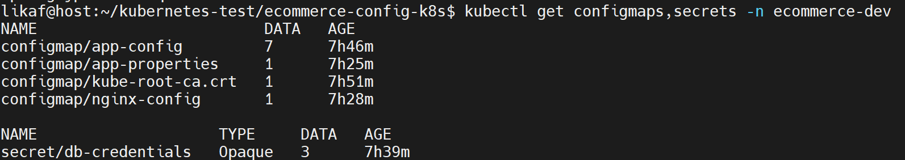
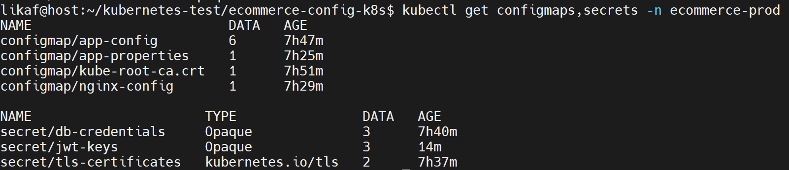
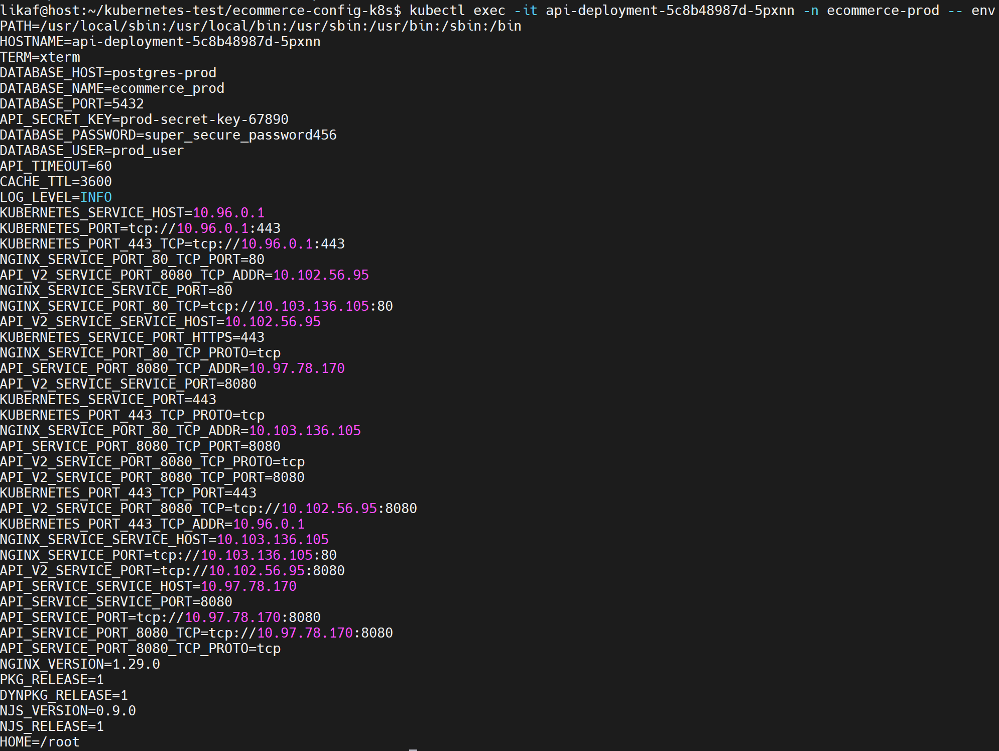

Данный тестовый проект служит для изучения возможнойстей управления конфигурация в Kubernetet (ConfigMap, Secret, Enviroment variables, Volume mounts).

Вывод команды kubectl get configmaps,secrets -n ecommerce-dev:

Вывод команды kubectl get configmaps,secrets -n ecommerce-prod:

Результат проверки переменных окружения в api-deployment для ecommerce-prod:

Результат проверки переменных окружения для dev указан в директории screenshots.

Содержимое смонтированных кофигруационных файлов указано в директории screenshots.

Доказательством успешного обновления конфигурации служит скриншот screenshots/updated-nginx-config.png. Для его запуска необходимо было поднять еще один Service с названием api-v2-service. Только после этого nginx начинает стартовать.

ConfigMap служит для хранения нечувствительнных данных, т.к. он не шифрует их и держит все в открытом виде. Secret как раз нужен для хранения чувствительных данных он использует для хранения данных шифрование в etcd.

Плюсами Enviroment Variables является простоые значения, легкость использования и стандартный механизм. Плюсами Volume Mounts являются возможность использовать файлы любого размера, сложные структуры, автообновление, настройка прав доступа к файлам.