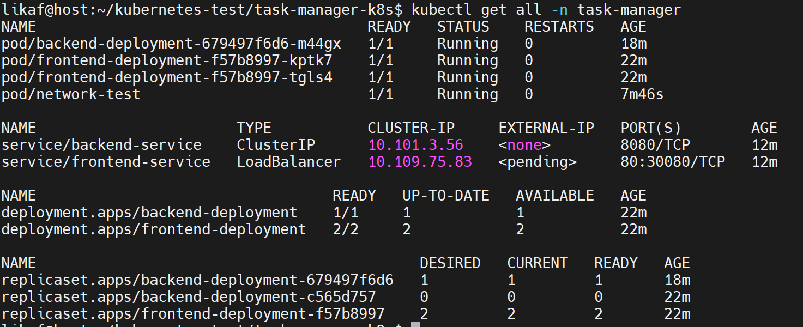
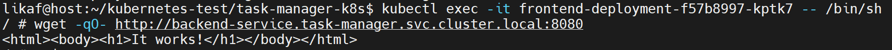

Данный тестовый проект служит для изучения основ Kubernetes (Pod, ReplicaSet, Deployment, Service).

Вывод команды kubectl get all -n task-manager:

Результат тестирования сетевой связанности между сервисами:

Также результат показан в screenshots/network-test.png из тестового пода.

Pod - наимешьная единиица развертывания в Kubernetes. Он содержит один или несколько конейнеров и служит для одноразового использвания, т.е. нет масштабирования и если его под убирает, то он не восстанавливается автоматически.

Deployment - контроллер, который управляет репликами Pod'ов и обеспечивает их бесперебойную работу. Позволяет масштабировать, обновлять и откатывать поды. Также позволяет восстановить Pod, если он падает.

Service - это абстракция, которая обеспечивает стабильный доступ к приложениям, работающим в Pod'ах. Типы Service:

ClusterIP - Назначение:

Внутренний виртуальный IP-адрес только внутри кластера.

Используется для связи между микросервисами внутри Kubernetes.

NodePort - Назначение:

Открывает статический порт на каждой ноде кластера.

Позволяет обращаться к сервису извне кластера через <IP_ноды>:<порт>.

LoadBalancer -Назначение:

Автоматически создает внешний балансировщик нагрузки (в облачных провайдерах: AWS, GCP, Azure).

Нужен для публикации сервисов в интернете.

Скриншоты выполнения основных шагов указаны в директории screenshots/