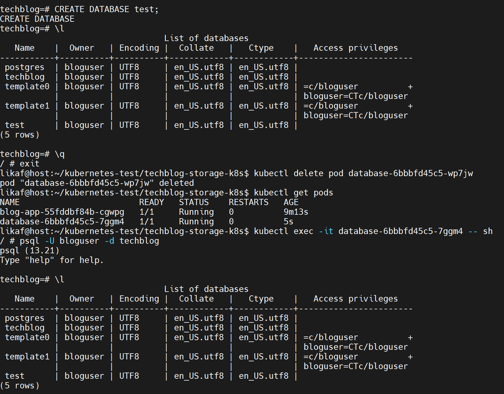
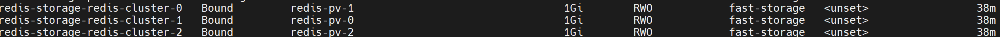
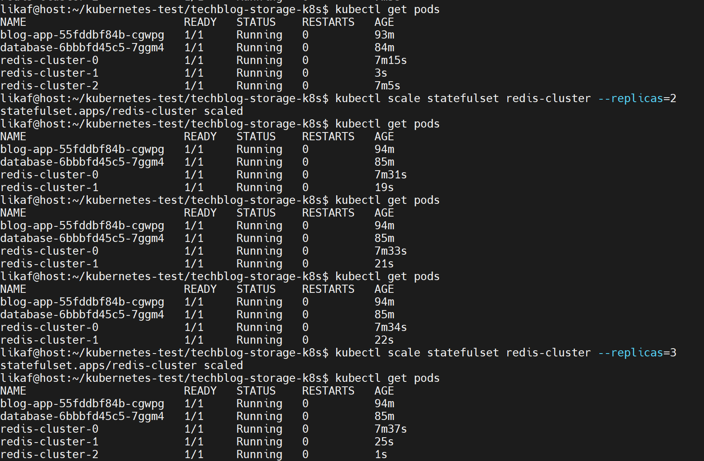

Данный тестовый проект служит для изучения возможнойстей работы с хранилищами в Kubernetet (Volumes, PersistentVolume, PersistentVolumeClaim, StorageClass, StatefulSet).

Вывод команды kubectl get pv,pvc,storageclass -n techblog представлен в директории screenshots.

Результат тестировани персистентности данных в PostgreSQL приведен был с созданием еще одной БД и удалением после этого пода. Далее зашел снова в под и проверил наличие новой БД:

Демонстрация уникальности PVC для каждого Pod'а в StatefulSet:

emptyDir создает пустую директорию при запуске пода. Данные хранятся, пока под жив. Подходил для временных файлов.
hostPath онтирует директорию или файл с хост-машины в под. Подходит для логов.
PVC Запрашивает том из PersistentVolume, который может быть на сетевом хранилище.

Deployment — для stateless-приложений, где Pod’ы взаимозаменяемы (например, веб-сервера).
StatefulSet — для stateful-приложений, где важны уникальность Pod’ов и сохранность их данных (например, базы данных).

Результаты тестирования масштабирования StatefulSet:
